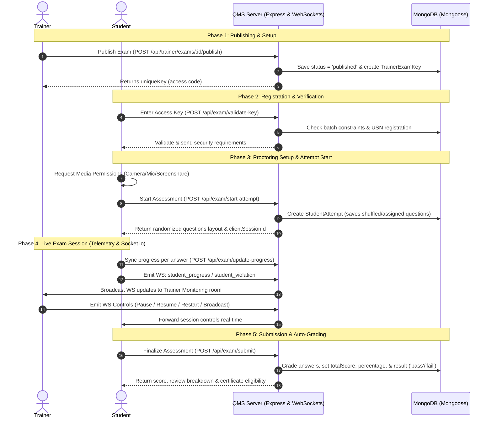

# Ethnotech Assessment Platform: Exam System Architecture & Flow

This document provides a comprehensive breakdown of how the exam system works under the hood, covering the database structure, frontend/backend communication, proctoring/cheat detection, real-time monitoring, auto-grading, and session recovery.

---

## 1. Core Data Models

The exam system is built around four primary Mongoose schemas:

| Model | Description | Key Attributes |
| :--- | :--- | :--- |
| **[Exam.js](file:///d:/Eth_Quiz_New/quiz/server/models/Exam.js)** | Holds the assessment metadata, configurations, and proctoring settings. | `collegeId`, `courseId`, `batches`, `duration` (mins), `passingPercentage`, `settings` (`shuffleQuestions`, `requireWebcam`, `requireMic`, `requireScreenshare`, `enableCertificate`) |
| **[Question.js](file:///d:/Eth_Quiz_New/quiz/server/models/Question.js)** | Stores questions mapped to an exam with a compound index on `examId`. | `examId`, `type` (`mcq`, `true_false`, `fill_blank`, `numeric`, `coding`, etc.), `text`, `points`, `options` (`choices`, `matchingPairs`, `orderedItems`), `correctAnswerText`, `codingDetails` |
| **[TrainerExamKey.js](file:///d:/Eth_Quiz_New/quiz/server/models/TrainerExamKey.js)** | Represents a generated active session key generated by a trainer to open an assessment for a specific batch. | `examId`, `trainerId`, `batchId`, `uniqueKey` (e.g. `JAVA-EX-B1-F8A2`), `isActive`, `isStarted`, `isPaused` |
| **[StudentAttempt.js](file:///d:/Eth_Quiz_New/quiz/server/models/StudentAttempt.js)** | Captures student submissions, telemetry, answers, and proctoring violations. | `examId`, `sessionId`, `studentDetails` (`rollNumber`, `name`, etc.), `answers` (`questionId`, `answer`, `isCorrect`, `marksObtained`, `timeSpent`), `totalScore`, `violations`, `clientSessionId`, `lastDisconnected` |

---

## 2. Exam Session Lifecycle

The lifecycle of an exam runs through several phases, depicted below:



---

## 3. Student Proctoring & Cheat Detection

To ensure exam integrity, the system implements a strict, client-enforced cheating detection engine using the custom Hook **[useCheatDetection.js](file:///d:/Eth_Quiz_New/quiz/client/src/hooks/useCheatDetection.js)**. 

### Triggered Violations
* **Tab Switching**: Uses `document.visibilityState` to catch students switching tabs or minimizing the browser.
* **Fullscreen Exits**: Detects when a student exits fullscreen mode (`fullscreenchange`). Fullscreen is requested immediately upon starting.
* **Window Blurs**: Listens for the window `blur` event, which occurs when clicking onto a secondary application, developer console, or OS pop-up.
* **Copy/Paste & Key Combinations**:
  * Prevents clipboard actions (`copy`, `paste`, `cut`).
  * Blocks keyboard combinations (`Ctrl+C`, `Ctrl+V`, `Ctrl+X`, `Ctrl+F`).
  * Intercepts `F12` and developer console shortcut keys (`Ctrl+Shift+I/J/C`).
* **Overlay Extensions**: Employs a `MutationObserver` on the body to detect browser translator overlays, helper tools (e.g., Grammarly), or high-index custom elements.
* **DevTools Open Detection**: Checks if the difference between outer dimensions and inner dimensions (`window.outerWidth - window.innerWidth` or `window.outerHeight - window.innerHeight`) exceeds `160px`.
* **Idle Check**: Tracks user scroll, keydown, click, and mouse movements. If no activity is recorded for `45 seconds`, it pops up a modal requesting interaction to reset the idle timer.

> [!IMPORTANT]
> **Threshold Submission**: Every time a violation is triggered:
> 1. The telemetry counters inside `StudentAttempt` are updated via `POST /api/exam/update-violations`.
> 2. The event is pushed via WebSockets to the trainer's monitor screen.
> 3. If **any single violation count reaches 3**, the system automatically triggers a background submission (`handleAutoSubmit`) to terminate the exam.

---

## 4. Trainer Supervision Dashboard

Trainers supervise the exam session via the **[WaitingRoom.jsx](file:///d:/Eth_Quiz_New/quiz/client/src/pages/trainer/WaitingRoom.jsx)** component. 
The monitoring dashboard provides real-time oversight of all connected candidates:

* **Session Control**:
  * **Start Session**: Allows candidates to move past the proctoring verification screen and access questions.
  * **Pause Session**: Pauses the exam, freezing the timer and overlaying a blocking screen for all students.
  * **Resume Session**: Restores the timer and hides the pause overlay.
  * **Force Submit**: Instantly ends the exam for all active/started students, grading their attempts up to that point.
* **Broadcast Announcements**: Send text alerts that pop up on all student screens via the `trainer_broadcast` socket event.
* **Live Chat**: Allows students to send messages directly to the trainer for technical support without leaving the browser viewport.

---

## 5. Reconnection & Auto-Submission (The System Sweeper)

To handle client crashes, power cuts, or network drops, the system implements a dual-safety reconnection architecture:

### Client-Side Resumption
If a student disconnects, they are allowed to resume their exam:
* A `clientSessionId` is stored in the student's local storage.
* If they reload the page, they can hit `/api/exam/resume/:sessionId` to fetch their state.
* The API tracks `resumeCount` and registers the reconnection window.

### Reconnection Limitations
* **The 3-Minute Limit**: If a student is disconnected for more than 3 minutes, calling `resumeSession` will trigger an immediate grading and submission of their progress, blocking them from restarting.
* **The 15-Minute Background Sweeper**: In `server/index.js`, a background interval runs every **5 minutes**. It scans for attempts that have been in progress (`started`, `active`, or `violated` status) but whose `lastDisconnected` timestamp is greater than **15 minutes ago**. It automatically executes the grading logic and saves the record as `completed` with the reason `"Auto-submitted by System Sweeper (Disconnected > 15 mins)"`.

---

## 6. Evaluation & Auto-Grading Logic

When a student manually submits, gets auto-submitted, or gets swept, the backend evaluates the attempt in **[examController.js](file:///d:/Eth_Quiz_New/quiz/server/controllers/examController.js)**:

1. **Answer Matching**:
   * **Single Choice (MCQ, True/False)**: Compares the submitted string option to the marked correct option:
     ```js
     isCorrect = String(submittedChoice).trim().toLowerCase() === String(correctChoice.text).trim().toLowerCase();
     ```
   * **Multiple Choice**: Filters correct options and verifies if the exact subset matches:
     ```js
     if (correctChoices.length === submittedArr.length) {
         isCorrect = correctChoices.every(c => submittedArr.includes(c));
     }
     ```
   * **Fill in the Blanks / Numeric**: Compares case-insensitive strings or parsed floats to the `correctAnswerText`.
2. **Metrics Computation**:
   * Evaluated marks are summed (`totalScore`).
   * Percentage is calculated: `(totalScore / exam.totalMarks) * 100`.
   * Result is set to `pass` or `fail` depending on the `passingPercentage`.
3. **Certificate Generation**:
   * If the student passes and `enableCertificate` is checked in the exam settings, they can request their PDF certificate.
   * **[certificateGenerator.js](file:///d:/Eth_Quiz_New/quiz/server/utils/certificateGenerator.js)** uses **PDFKit** to write a formatted PDF certificate containing the student's name, USN, course title, score, and institutional branding.
